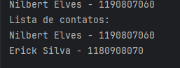

# IPHONE MODEL
Baseado na primeira apresentação do iphone feita pelo sr. Steve Jobs, surgiu a ideia na @https://github.com/digitalinnovationone para desenvolver um protótico
usando os conhecimentos da UML e por em prática usando a linguagem JAVA.
Para que alcançemos a satisfação desse desafio precisamos ter 3 classes que abstraem do mundo real as seguintes funcionalidades:

 * Telefone;
 * Reprodutor De Música;
 * Navegador;

Usaremos o paradigma da Orientação a Objeto para fazer a entrega desse desafio!

## IDEALIZAÇÃO UML:
Segundo o google IML é a sigla para Unified Modeling Language, ou Linguagem de Modelagem Unificada, um padrão de modelagem visual utilizado na engenharia de software.
Neste caso utilizaremos o diagrama de classe que nada mais é que um tipo de diagrama da Linguagem de Modelagem Unificada (UML) que mapeia a estrutura de um sistema orientado a objetos.

### Mãos na Massa:
Para cumprir as condições proposta dividi o sistema em 4 classes principais sendo a  classe a Iphone a que servirá de enter point da aplicação, onde criaremos as instâncias de cada obejto 
a fim de testa-las, partindo dela buscamos implementar as classes supracitadas( Navegador, Reproduto de Música, Telefone) buscando implentar os atributos e classes mais pertinentes para 
esse desafio.

Logo abaixo está a minha solução desse desafio:

## MÃOS NA MASSA:
Agora que já idealizamos o minimo que precisamos para alcançar o objetivo, vamos começar a desenvolver.

Neste primeiro instante criei pacotes (Packages) para facilitar a organização do código:

Logo em seguida busquei começar pela classe do reprodutor de música, criando os atributos privados e logo em seguida buscando desenvolver seus metódos getters e setters (Padrão Java Bean):

Após isso desenvolvi os métodos pertinente a essa classe:

e fiz o mesmo com a classe musica:

Por fim fiz alguns testes para verificar os resultados (Classe Iphone):

E obtive sucesso como mostram os resultados:

Com esse resuldo comecei a desenvolver a classe de navegação e telefone com a mesma estrutura obtendo bons resultados como mostrado na imagem abaixo:

